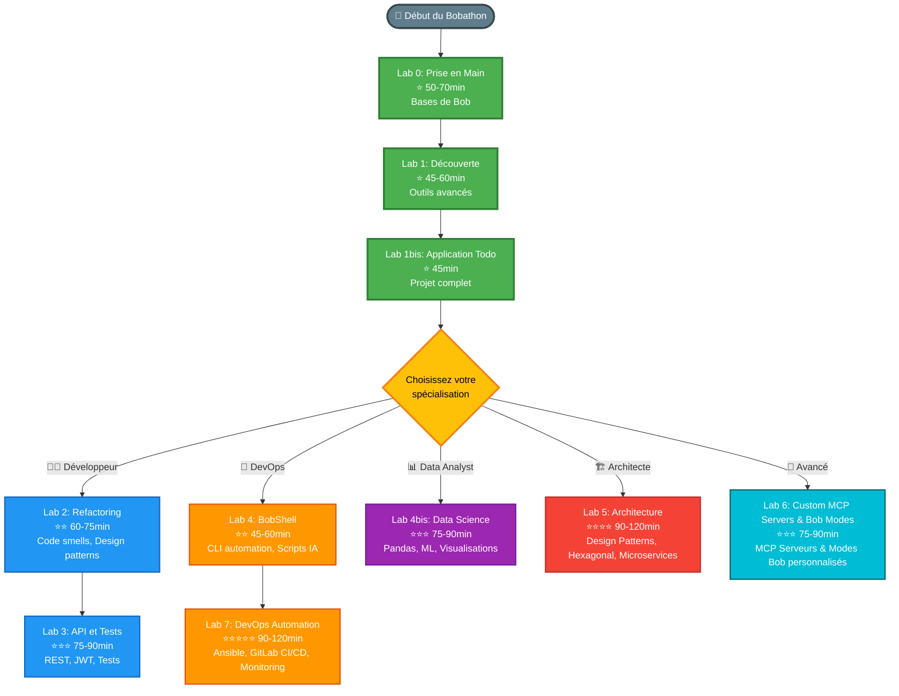

# 🚀 Bobathon 2026

Bienvenue au Bobathon ! Un événement de formation pour découvrir et maîtriser Bob, votre assistant IA pour le développement.

## 📋 Structure du Projet

```
GHBObAthon/
├── readme.md                    # Ce fichier
├── requirements.txt             # Dépendances Python pour tous les labs
├── presentation/                # Supports de présentation (2h)
│   ├── PRESENTATION.md
│   └── SLIDES.md
├── labs/                        # 10 labs pratiques (8h30-11h30 total)
│   ├── lab0-prise-en-main/     # 50-70 min ⭐
│   ├── lab1-decouverte/        # 45-60 min ⭐
│   ├── lab1bis-creer-une-appli/ # 45 min ⭐
│   ├── lab2-refactoring/       # 60-75 min ⭐⭐
│   ├── lab3-api-tests/         # 75-90 min ⭐⭐⭐
│   ├── lab4-bobshell/          # 45-60 min ⭐⭐
│   ├── lab4bis-data-science/   # 75-90 min ⭐⭐⭐
│   ├── lab5-architecture/      # 90-120 min ⭐⭐⭐⭐
│   ├── lab6-custom-mcp-modes/  # 75-90 min ⭐⭐⭐
│   └── lab7-devops-automation/ # 90-120 min ⭐⭐⭐⭐⭐
```

## 🎯 Programme

### 1. Présentation (30 mn)
- Introduction à Bob
- Capacités et outils
- Démonstrations live
- Installation et configuration

### 2. Labs Pratiques (9:00-12:45; 13:45-16:00)
Progression recommandée selon votre profil :

- **[Lab 0](labs/lab0-prise-en-main)** : Prise en Main de Bob (débutant - COMMENCEZ ICI !) ⭐
- **[Lab 1](labs/lab1-decouverte)** : Découverte et Premiers Pas avec Bob (débutant) ⭐
- **Lab 1bis** : Créer une Application Todo (débutant à intermédiaire) ⭐
- **Lab 2** : Refactoring et Amélioration de Code (intermédiaire) ⭐⭐
- **Lab 3** : Création d'API et Tests (avancé) ⭐⭐⭐
- **Lab 4** : BobShell et Utilisation en Ligne de Commande (intermédiaire) ⭐⭐
- **Lab 4bis** : Data Science et Analyse de Données (avancé) ⭐⭐⭐
- **Lab 5** : Architecture et Design Patterns (expert) ⭐⭐⭐⭐
- **Lab 6** : Création de Serveurs MCP et Modes Personnalisés (avancé) ⭐⭐⭐
- **Lab 7** : DevOps, Automation & Playbooks (expert) ⭐⭐⭐⭐⭐

## 🗺️ Parcours d'Apprentissage

### Vue d'ensemble



### Tronc Commun (Obligatoire pour tous) 🌟
Commencez par les labs 0, 1 et 1bis pour acquérir les bases essentielles

### Parcours par Profil

#### 👨‍💻 Parcours Développeur
**Pour les développeurs souhaitant améliorer leur code et créer des APIs**

```
Lab 2: Refactoring        Lab 3: API et Tests
⭐⭐ 60-75min             ⭐⭐⭐ 75-90min

Code smells              APIs REST
Design patterns          JWT Auth
Qualité du code          Tests complets
```

#### 🔧 Parcours DevOps
**Pour les ops et ingénieurs infrastructure**

```
Lab 4: BobShell          Lab 7: DevOps Automation
⭐⭐ 45-60min             ⭐⭐⭐⭐⭐ 90-120min

CLI automation           Ansible playbooks
Scripts IA               GitLab CI/CD
Pipelines CI/CD          Monitoring (Dynatrace)
```

#### 📊 Parcours Data Analyst
**Pour l'analyse de données et le machine learning**

```
Lab 4bis: Data Science
⭐⭐⭐ 75-90min

Pandas & NumPy
Visualisations
Modèles ML
Évaluation
```

#### 🏗️ Parcours Architecte
**Pour concevoir des systèmes robustes et scalables**

```
Lab 5: Architecture
⭐⭐⭐⭐ 90-120min

15+ Design Patterns
Architecture hexagonale
Microservices
SOLID, DRY, KISS
```

#### 🚀 Parcours Avancé
**Pour découvrir les usages avancés de Bob**

```
Lab 6: Custom MCP Servers & Bob Modes
⭐⭐⭐ 75-90min

Serveurs MCP personnalisés
Outils personnalisés
Modes Bob sur mesure
```

### Recommandations

- **Débutants** : Suivez le tronc commun (Labs 0, 1, 1bis) puis choisissez UN parcours spécialisé
- **Intermédiaires** : Tronc commun + 2 parcours de votre choix
- **Experts** : Tous les labs pour une maîtrise complète de Bob

**Durée totale estimée** :
- Tronc commun : 2h20-3h15
- + 1 parcours spécialisé : 3h30-5h30 total
- Tous les labs : 8h30-11h30

## 🎓 Contenu des Labs

### [Lab 0 : Prise en Main de Bob](labs/lab0-prise-en-main) ⭐
**Durée** : 60-90 minutes
**Niveau** : Débutant - **COMMENCEZ ICI !**

Apprenez à :
- Communiquer efficacement avec Bob
- Utiliser les outils de base (read_file, apply_diff, execute_command)
- Comprendre le workflow étape par étape
- Créer un projet complet guidé
- Débugger du code avec Bob

**6 exercices progressifs + 1 bonus** pour maîtriser les fondamentaux.

### [Lab 1 : Découverte et Premiers Pas](labs/lab1-decouverte) ⭐
**Durée** : 45-60 minutes
**Niveau** : Débutant

Apprenez à :
- Approfondir la communication avec Bob
- Lire et explorer des fichiers
- Créer et modifier du code
- Exécuter des commandes avancées

### Lab 1bis : Créer une Application Todo ⭐
**Durée** : 45 minutes
**Niveau** : Débutant à Intermédiaire

Apprenez à :
- Construire une application Todo full-stack complète
- Découvrir les différents modes de Bob (Architect, Code, Ask)
- Utiliser les auto-approbations
- Pratiquer le codage littéraire
- Intégrer avec GitHub
- Créer un backend API REST Python Flask avec SQLite
- Développer un frontend JavaScript moderne

### Lab 2 : Refactoring et Amélioration ⭐⭐
**Durée** : 60-75 minutes  
**Niveau** : Intermédiaire

Apprenez à :
- Identifier les code smells
- Appliquer des techniques de refactoring
- Utiliser des design patterns
- Améliorer la qualité du code

### Lab 3 : Création d'API et Tests ⭐⭐⭐
**Durée** : 75-90 minutes
**Niveau** : Avancé

Apprenez à :
- Créer des APIs REST avec Flask
- Implémenter l'authentification JWT
- Écrire des tests complets
- Documenter les APIs

### Lab 4 : BobShell et Utilisation en Ligne de Commande ⭐⭐
**Durée** : 45-60 minutes
**Niveau** : Intermédiaire

Apprenez à :
- Utiliser BobShell pour l'exécution de commandes interactive et non-interactive
- Créer des scripts d'automatisation qui exploitent les capacités IA de Bob
- Intégrer Bob dans les pipelines CI/CD

### Lab 4bis : Data Science et Analyse de Données ⭐⭐⭐
**Durée** : 75-90 minutes
**Niveau** : Avancé

Apprenez à :
- Analyser des données avec pandas
- Créer des visualisations
- Construire des modèles ML
- Évaluer les performances

### Lab 5 : Architecture et Design Patterns ⭐⭐⭐⭐
**Durée** : 90-120 minutes
**Niveau** : Expert

Apprenez à :
- Concevoir des architectures robustes
- Appliquer 15+ design patterns
- Implémenter l'architecture hexagonale
- Créer des systèmes scalables

### Lab 6 : Création de Serveurs MCP et Modes Personnalisés ⭐⭐⭐
**Durée** : 75-90 minutes
**Niveau** : Avancé

Apprenez à :
- Comprendre l'architecture du Model Context Protocol (MCP)
- Créer des serveurs MCP personnalisés
- Implémenter des outils personnalisés
- Intégrer Bob avec des API externes
- Créer des modes Bob personnalisés adaptés aux workflows spécifiques

### Lab 7 : DevOps, Automation & Playbooks ⭐⭐⭐⭐⭐
**Durée** : 90-120 minutes
**Niveau** : Expert

Apprenez à :
- Créer des playbooks Ansible pour l'orchestration
- Configurer des pipelines GitLab CI/CD complets
- Intégrer des tests de performance (NeoLoad + Dynatrace)
- Automatiser avec RPA et IA Factory
- Utiliser l'API Marketplace et TSDL
- Orchestrer des déploiements complexes

**Technologies** : Ansible, GitLab CI/CD, NeoLoad, Dynatrace, RPA, IA Factory, API Marketplace, TSDL

## 💡 Conseils pour Réussir

### DO ✅
- Soyez spécifique dans vos demandes à Bob
- Validez chaque étape avant de continuer
- Expérimentez et itérez
- Posez des questions
- Partagez vos découvertes

### DON'T ❌
- Ne soyez pas vague
- N'assumez pas sans vérifier
- Ne sautez pas d'étapes
- N'hésitez pas à demander de l'aide

## 🚀 Installation

### Prérequis

#### Obligatoires (Tous les Labs)
- **IBM Bob** (dernière version)
- **Python 3.8+**
- **Node.js 14+**
- **Git**

#### Optionnels (selon les labs)
- **BobShell CLI** (Lab 4 - installation séparée sur Windows)
- **Docker** (Lab 5, Lab 6, Lab 7)
- **Kubernetes** (Lab 6, Lab 7 - optionnel)
- **Ansible** (Lab 7)
- **curl** (Lab 1, Lab 3 - pour tester les APIs)

#### Comptes et Services (optionnels)
- **Compte GitHub** (Lab 1bis - pour l'intégration Git)
- **GitLab** (Lab 7 - pour CI/CD)

### Configuration de l'Environnement

#### Configuration de Base (Tous les Labs)

```bash
# 1. Cloner le repository

# 2. Créer l'environnement virtuel Python
python3 -m venv .venv

# 3. Activer l'environnement virtuel
source .venv/bin/activate  # macOS/Linux
# .venv\Scripts\activate  # Windows

# 4. Vérifier l'installation
python --version  # Doit afficher Python 3.8+
node --version    # Doit afficher Node.js 14+
pip --version
```

#### Installation des Dépendances par Lab

**Labs 0-2** : Aucune dépendance supplémentaire requise

**Lab 1bis** : Application Todo Full-Stack
```bash
cd labs/lab1bis-creer-une-appli
pip install flask flask-cors sqlalchemy
```

**Lab 3** : API et Tests
```bash
cd labs/lab3-api-tests
pip install -r api/requirements.txt
# Inclut: flask, flask-jwt-extended, pytest, pytest-cov, flasgger
```

**Lab 4** : BobShell
```bash
# Vérifier que BobShell est installé
bobshell --version
# Sur Windows, installation séparée requise
```

**Lab 4bis** : Data Science
```bash
cd labs/lab4bis-data-science
pip install pandas numpy matplotlib seaborn scikit-learn jupyter tabulate
```

**Lab 5** : Architecture
```bash
cd labs/lab5-architecture
pip install fastapi uvicorn sqlalchemy pydantic redis celery
# Docker recommandé pour les microservices
```

**Lab 6** : Custom MCP Servers & Bob Modes
```bash
cd labs/lab6-custom-mcp-modes
# Pour Node.js:
npm install @modelcontextprotocol/sdk express axios dotenv winston
# OU pour Python:
pip install mcp flask requests python-dotenv
```

**Lab 7** : DevOps Automation
```bash
cd labs/lab7-devops-automation
# Ansible requis
pip install ansible docker-compose pytest
# GitLab CI/CD, Dynatrace, NeoLoad configurés séparément
```

#### Installation Globale (Optionnel)

Pour installer toutes les dépendances Python d'un coup :
```bash
pip install -r requirements.txt
```

**Note** : Cette approche installe toutes les dépendances, même celles non nécessaires pour votre parcours. L'installation par lab est recommandée.

### Vérification de Bob

1. Ouvrez IBM Bob
2. Vérifiez que Bob est actif
3. Testez avec : "Hello Bob"

## 📚 Comment Utiliser ce Repository

### Pour les Participants

1. **Commencez par la présentation** (2h)
   - Lisez `presentation/PRESENTATION.md`
   - Suivez les slides dans `presentation/SLIDES.md`

2. **Familiarisez-vous avec Bob** (à votre rythme)
   - Suivez le `GUIDE_PRISE_EN_MAIN.md`
   - Faites les exercices guidés
   - Testez les différents outils

3. **Choisissez vos labs** (6h total)
   - Commencez par le Lab 1 si vous débutez
   - Sautez aux labs avancés si vous êtes à l'aise
   - Chaque lab est indépendant

### Pour les Organisateurs

- Les supports de présentation sont dans `presentation/`
- Chaque lab contient des instructions détaillées
- Les solutions peuvent être générées avec Bob
- Le dossier `test/` contient des exemples de tests

## 🆘 Support

### Pendant le Bobathon
- Levez la main pour les organisateurs
- Demandez à Bob de clarifier
- Consultez vos collègues

### Après le Bobathon
- Documentation officielle de Bob
- Forum communautaire
- Support technique

## 📊 Évaluation

Les participants seront évalués sur :
- **Efficacité** (25%) : Temps pour accomplir les tâches
- **Qualité** (35%) : Code produit et solutions
- **Créativité** (20%) : Approches innovantes
- **Collaboration** (20%) : Utilisation optimale de Bob

## 🏆 Objectifs d'Apprentissage

À la fin du Bobathon, vous serez capable de :
- ✅ Utiliser Bob efficacement dans vos projets
- ✅ Créer des applications complètes avec Bob
- ✅ Refactorer du code legacy
- ✅ Analyser des données et créer des modèles ML
- ✅ Concevoir des architectures robustes
- ✅ Appliquer les meilleures pratiques de développement

## 📝 Licence

Ce projet est créé pour le Bobathon 2026.

## 🙏 Remerciements

Merci à tous les participants et organisateurs du Bobathon 2026 !

---

**Bon Bobathon et amusez-vous bien !** 🎉
