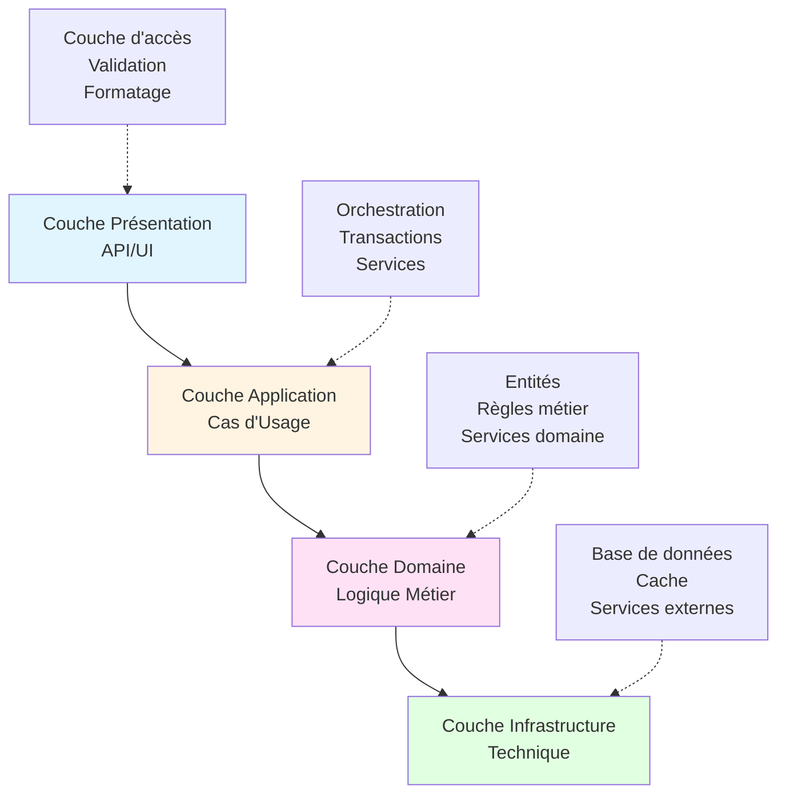
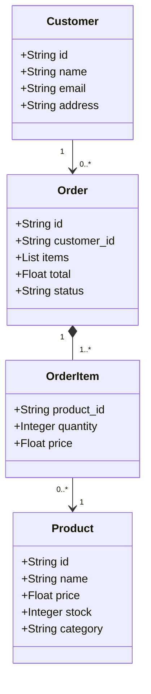
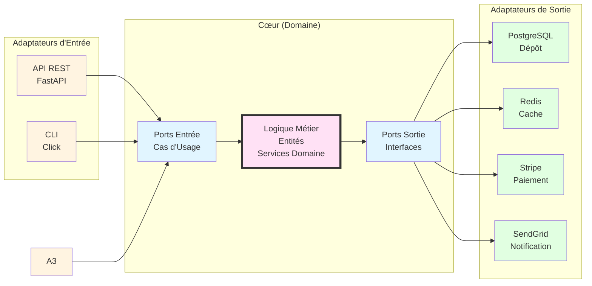
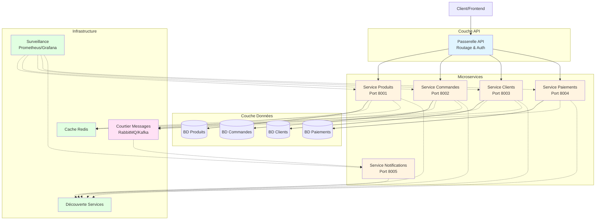

# 🏗️ Lab 5 : Architecture et Design Patterns

> **Durée estimée** : 90-120 minutes  
> **Difficulté** : ⭐⭐⭐⭐ Expert  
> **Objectif** : Maîtriser l'architecture logicielle et les design patterns avancés

---

## 📋 Objectifs d'Apprentissage

À la fin de ce lab, vous serez capable de :

✅ Concevoir des architectures logicielles robustes  
✅ Implémenter des design patterns avancés  
✅ Créer des systèmes modulaires et scalables  
✅ Gérer la complexité dans les grands projets  
✅ Documenter l'architecture  

---

## 🎯 Livrable Final

À la fin de ce lab, vous aurez créé :

**Une application e-commerce** qui :

✅ Illustre tous les design patterns étudiés  
✅ Possède une architecture complète et documentée  
✅ Contient du code fonctionnel pour chaque pattern  
⚠️ N'est PAS une application production-ready  

Il est important de se focaliser sur la qualité architecturale, pas sur la complétude des fonctionnalités  

**Ce que vous DEVEZ implémenter** :

- Structure des répertoires
- Définition des entités du domaine
- Les design patterns
- La documentation de l'architecture

**Ce qui est OPTIONNEL** :

- Base de données réelle (mocks acceptés)
- APIs REST complets (endpoints de démonstration suffisants)
- Intégrations avec des systèmes réels

> 💡 **Note importante** : L'objectif est d'apprendre et de démontrer votre maîtrise des patterns et de l'architecture, pas de créer une application e-commerce complète et fonctionnelle. Concentrez-vous sur la complétude et la clarté de l'architecture.

---

## 🚀 Mise en Place

### Prérequis

- Avoir complété les Labs 0, 1 et 1 bis
- Bonne compréhension de la Programmation Orientée Objets (POO)
- Python 3.8+ installé
- Connaissances en architecture logicielle (utile)
- Environnement virtuel Python (`.venv` à la racine du projet)

### Installation des Dépendances

Activer l'environnement virtuel (à la racine du projet)

```bash
# 
# macOS/Linux
source .venv/bin/activate
```

```bash
# Windows (PowerShell)
.venv\Scripts\Activate.ps1
```
```bash
# Windows (CMD)
.venv\Scripts\activate.bat
```

Installer les dépendances

```bash
pip install fastapi uvicorn sqlalchemy pydantic redis celery docker-compose
```

---

## 📝 Exercice 1 : Architecture en Couches (25 min)

### Objectif

Concevoir une application e-commerce avec une architecture en couches claire.

### 📊 Architecture Visuelle



### Instructions

1. **Définissez l'architecture** :

   ```
   Crée docs/ARCHITECTURE.md décrivant une architecture en 4 couches :

   1. Presentation Layer (API/UI)
      - Endpoints REST
      - Validation des inputs
      - Formatage des réponses

   2. Application Layer (Use Cases)
      - Logique applicative
      - Orchestration des services
      - Gestion des transactions

   3. Domain Layer (Business Logic)
      - Entités métier
      - Règles business
      - Domain services

   4. Infrastructure Layer (Technical)
      - Base de données
      - Cache
      - Services externes

   Explique les responsabilités de chaque couche et leurs interactions.
   ```

2. **Implémentez la structure** :

   ```
   Crée la structure de dossiers suivante dans src/ :

   src/
   ├── presentation/
   │   ├── api/
   │   │   ├── routes/
   │   │   └── schemas/
   │   └── cli/
   ├── application/
   │   ├── use_cases/
   │   └── services/
   ├── domain/
   │   ├── entities/
   │   ├── value_objects/
   │   └── repositories/
   └── infrastructure/
       ├── database/
       ├── cache/
       └── external/
   ```

3. **Créez les entités du domaine** :

L'objectif ici est d'implémenter ce modèle de données :



Instructions Bob :
   ```
   Implémente dans domain/entities/ le modèle de données :
   - Product avec pour attributs id, name, price, stock, category
   - Customer (id, name, email, address)
   - Order avec pour attributs id, items, total, status, et associé à Customer via customer_id   
   - OrderItem avec pour attributs quantity, price, et associé à Product via product_id

   inclus les validations et règles métier (ex: le stock ne peut pas être négatif).
   ```

5. **Implémentez les inventaires** :

   ```
   Crée des interfaces d'inventaire dans domain/repositories/ :
   - IProductRepository pour les produits
   - IOrderRepository pour les commandes
   - ICustomerRepository pour les clients

   Et leurs implémentations dans infrastructure/database/.
   ```

### ✅ Critères de Validation

- [ ] Architecture documentée clairement
- [ ] Structure des répertoires respectée
- [ ] Entités du domaine créées avec leurs contraintes de validation
- [ ] Inventaires implémentés
- [ ] Séparation des responsabilités claire

### 💡 Principe Clé

**Inversion des dépendances** : Les couches hautes ne dépendent pas des couches basses => Utilisation des interfaces/abstractions.

---

## 🎨 Exercice 2 : Design Patterns Créationnels (20 min)

### Objectif

Implémenter des patterns pour la création d'objets complexes.

### Instructions

1. **Pattern Fabrique** :

   ```
   Définit dans src/core/factories/product_factory.py :
   - Une fabrique abstraite ProductFactory pour l'ensemble des produits
   - Les fabriques concrètes :
     * ElectronicsFactory pour les produits électroniques
     * ClothingFactory pour les vêtements
     * FoodFactory pour les aliments
   - Chaque fabrique devrait permettre de créer des produits de type associé, avec les attributs spécifiques
   ```

2. **Pattern Constructeur** :

   ```
   Définit dans src/core/builders/order_builder.py une fabrique OrderBuilder pour :
   - construire des commandes au travers de méthodes chaînables :
     * add_item(product, quantity)
     * set_customer(customer)
     * apply_discount(percentage)
     * set_shipping_address(address)
     * build() -> Order
   - valider chaque commande avant de la construire
   ```

3. **Pattern Singleton** :

   ```
   Définit dans src/infrastructure/config/app_config.py un singleton thread-safe
   avec une méthode get_instance pour la configuration de l'application :
   Charger les configs depuis un fichier ou via des variables d'environnement
   ```

4. **Pattern Prototype** :
   ```
   Définit dans src/core/prototypes/product_prototype.py un prototype permettant de cloner
   des produits existants, utile par exemple pour créer des variantes de produits.
   Il faudrait bien entendu implémenter les méthodes __copy__ et __deepcopy__
   ```

### ✅ Critères de Validation

- [ ] Pattern Fabrique implémenté pour 3 types de produits
- [ ] Pattern Constructeur pour les commandes
- [ ] Singleton thread-safe implémenté pour la configuration de l'application
- [ ] Un pattern Prototype fonctionnel

### 💡 Quand Utiliser

- **Fabrique** : Création d'objets avec logique complexe
- **Constructeur** : Construction d'objets avec beaucoup de paramètres
- **Singleton** : Lorsqu'une seule instance d'un objet est nécessaire (config, logger)
- **Prototype** : Pour le clonage d'objets coûteux à créer

---

## 🔗 Exercice 3 : Design Patterns Structurels (25 min)

### Objectif

Organiser les relations entre objets et classes.

### Instructions

1. **Pattern Adaptateur** :

   ```
   Définit dans src/infrastructure/adapters/ des adaptateurs pour l'interaction avec des services externes :

   - PaymentAdapter, interface commune pour différents services de paiement, avec des implémentations pour stripe, paypal et crypto
   - NotificationAdapter : Interface commune pour différents canaux de communication, avec des implémentation pour l'email, le sms et les notifcation push
   ```

2. **Pattern Decorateur** :

   ```
   Définit des décorateurs dans src/application/decorators/ pour l'ajout de certaines fonctionnalités :

   - LoggingDecorator : Log les appels de méthodes
   - CachingDecorator : Cache les résultats
   - RetryDecorator : Réessaye en cas d'échec
   - TimingDecorator : Mesure le temps d'exécution

   Applique-les aux use cases et services.
   ```

3. **Pattern Façade** :

   ```
   Définit dans src/application/facades/order_facade.py une interface en vue de simplifier la création de commandes complètes, de manière à orchestrer les services de :
     * Vérification du stock
     * Calcul du prix
     * Traitement du paiement
     * Envoi des notifications
     * Mise à jour de l'inventaire

   L'interface doit à la fois gérer les transactions et les rollbacks
   ```

4. **Pattern Composition** :
   ```
   Crée dans src/domain/entities/category.py la hiérarchie (arbre) des catégories de produits,
   sachant que chaque catégorie peut contenir des sous-catégories et des produits.
   Implémente deux méthodes récursives :
   - get_all_products pour récupérer les produits d'une catégorie
   - calculate_total_value pour calculer la valeur totale des produits d'une catégorie
   ```

### ✅ Critères de Validation

- [ ] Adaptateurs pour au moins 2 services externes
- [ ] 4 decorateurs fonctionnels
- [ ] Façade simplifiant un processus complexe
- [ ] Composition pour la hiérarchie des catégories

### 💡 Avantages

- **Adaptateur** : Intégration facile de services tiers
- **Decorateur** : Ajout de fonctionnalités sans modifier le code
- **Façade** : Simplification d'interfaces complexes
- **Composition** : Traitement uniforme d'objets individuels et composés

---

## ⚙️ Exercice 4 : Design Patterns Comportementaux (30 min)

### Objectif

Gérer les algorithmes et les responsabilités entre objets.

### Instructions

1. **Pattern Strategie** :

   ```
   Crée différentes stratégies au sein de src/application/strategies/ :

   - PricingStrategy pour les stratégies de prix :
     * Prix réguliers
     * Réductions
     * Prix saisonniers
     * Tarifs fidélité

   - ShippingStrategy pour les stratégies d'expédition :
     * Expédition standard
     * Expédition expresse
     * Expédition gratuite si la commande est au dessus d'un certain montant seuil
   ```

2. **Pattern Observateur** :

   ```
   Définit au sein de src/core/events/event_system.py :
   - EventManager pour la gestion des événements :
     * Création d'un commande
     * Expédition d'une commande
     * Traitement d'un paiement
     * Stock bas
   - Implémente des observateurs :
     * Notification par email
     * Mise à jour du stock
     * Suivi analytique
   ```

3. **Pattern Commande** :

   ```
   Définit au sein de src/application/commands/ une interface avec des méthode execute et undo à même d'encapsuler les actions :
     * D'enregistrement d'une commande
     * D'annulation d'une commande
     * De mise mise à jour du stock suite au traitement d'une commande     
   Définit également un invocateur pour l'exécution et l'historisation
   ```

4. **Pattern Etats** :

   ```
   Définit au sein de src/domain/states/order_state.py :
   - Les états possibles d'une commande :
     * En attente
     * En traitement
     * Expédiée
     * Livrée
     * Annulée
   - Les transitions valides entre ses états
   - Les actions spécifiques à chaque état
   ```

   **Diagramme des états et transitions :**

   ```mermaid
   stateDiagram-v2
       [*] --> en_attente
       en_attente --> en_traitement: Paiement validé
       en_attente --> annulée: Annulation client
       en_traitement --> expédiée: Expédition
       en_traitement --> annulée: Échec traitement
       expédiée --> livrée: Livraison confirmée
       expédiée --> annulée: Retour
       livrée --> [*]
       annulée --> [*]

       note right of en_attente
           Commande créée
           En attente de paiement
       end note

       note right of en_traitement
           Paiement accepté
           Préparation en cours
       end note

       note right of expédiée
           Colis en transit
           Tracking disponible
       end note
   ```

5. **Chaîne de Responsibilités** :
   ```
   Crée au sein de src/application/handlers/validation_chain.py :
   - La chaîne de validation des commandes :
     * Validation du stock
     * Validation des prix
     * Validation des clients
     * Validation des paiements
   - Chaque gestionnaire décide si l'opération peut continuer ou doit s'arrêter
   ```

### ✅ Critères de Validation

- [ ] 2 strategies implémentées (prix et expédition)
- [ ] Gestionnaire d'évènements avec 3+ observateurs
- [ ] 4 commandes avec mécanismes d'annulation
- [ ] Gestionnaire d'états pour les commandes
- [ ] Chaîne de validation fonctionnelle

---

## 🏛️ Exercice 5 : Architecture Hexagonale (30 min)

### Objectif

Implémenter une architecture hexagonale (Ports & Adaptateurs).

### Instructions

1. **Définissez les ports** :

   ```
   Définit des interfaces au sein de src/core/ports/ qui serviront de :

   Ports d'entrée, notamment pour les use cases :
   - ICreateOrderUseCase : pour la définition des commandes
   - IGetOrderUseCase : pour le chargement des commandes
   - IUpdateInventoryUseCase : pour la mise à jour de l'inventaire

   Ports de sortie (inventaires, services) :
   - IOrderRepository : pour les commandes
   - IPaymentService : pour les paiements
   - INotificationService : pour les notifcations
   ```

2. **Implémentez les adaptateurs** :

   ```
   Définit au sein de src/adapters/ :

   Des adaptateurs d'entrée (drivers) :
   - RestApiAdapter (FastAPI) : pour l'interaction par API
   - CLIAdapter (Click) : pour l'interaction en ligne de commandes   

   Des adaptateurs de sortie :
   - PostgresOrderRepository : pour la persistance de l'inventaire au sein du base postgres
   - RedisCache : pour la mise en cache via Redis
   - StripePaymentService : pour le paiement via Stripe
   - SendGridNotificationService : pour l'envoi de notifications
   ```

3. **Implémentez la logique métier** :

   ```
   Implémente la logique métier dans src/core/ pour :
   - la gestion des entités du domaine (indépendantes de l'infrastructure)
   - l'orchestration des use cases
   - les services
   ```

4. **Configurez l'injection de dépendances** :

   ```
   Implémente au sein de src/di/container.py un injecteur de dépendances pour la configuration des rouages entre ports et adaptateurs.
   L'injection doit permettre de changer facilement d'implémentation.
   ```

5. **Documentez l'architecture** :
   ```
   Définit au sein de docs/HEXAGONAL_ARCHITECTURE.md :
   - Un diagramme de l'architecture
   - Une présentation claire des ports et adaptateurs
   - Les avantages de cette approche
   - Un guide pour ajouter de nouveaux adaptateurs
   ```

### 📊 Architecture Hexagonale Visuelle



### ✅ Critères de Validation

- [ ] Ports définis clairement
- [ ] Au moins 2 adaptateurs par type (input/output)
- [ ] Logique métier indépendante de l'infrastructure
- [ ] Injection de dépendances configurée
- [ ] Documentation complète

### 💡 Avantages de l'Architecture Hexagonale

- **Testabilité** : Logique métier (core) testable sans infrastructure
- **Flexibilité** : Changement facile d'implémentation
- **Indépendance** : Logique métier isolé des frameworks
- **Maintenabilité** : Séparation claire des responsabilités

---

## 🎯 Exercice Bonus : Microservices (Optionnel)

### Mission

Décomposer l'application en microservices.

### Instructions

```
Crée une architecture microservices avec :

1. Services :
   - Gestion des produits
   - Gestion des commandes
   - Gestion des clients
   - Traitement des paiements
   - Traitement des notifications

2. Communication :
   - API Gateway (routing, authentification)
   - Message Broker (RabbitMQ ou Kafka)
   - Service Discovery (Consul ou Eureka)

3. Infrastructure :
   - Docker Compose pour orchestration locale
   - Base de données par service
   - Cache distribué (Redis)
   - Monitoring (Prometheus + Grafana)

4. Patterns :
   - Disjoncteur pour la résilience
   - Pattern Saga pour les transactions distribuées
   - Séparation des responsabilités entre commandes et requêtes (CQRS : Command Query Responsibility Segregation) pour la séparation lecture/écriture
   - Historisation des événements

5. Documentation :
   - Diagramme d'architecture
   - Documentation des APIs (OpenAPI)
   - Guide de déployment
   - Guide de monitoring
```

### 📊 Architecture Microservices Visuelle



### ✅ Critères de Validation

- [ ] Au moins 3 microservices fonctionnels
- [ ] Communication inter-services
- [ ] Docker Compose configuré
- [ ] Disjoncteur implémenté
- [ ] Documentation complète

---

## 📊 Auto-Évaluation Finale

- [ ] Je connais au moins 10 design patterns
- [ ] Je peux concevoir une architecture en couches
- [ ] Je sais implémenter une architecture hexagonale
- [ ] Je comprends les microservices
- [ ] Je peux documenter une architecture
- [ ] Je suis prêt à utiliser Bob dans des projets réels

---

## 🎓 Ce que Vous Avez Appris

### Principes d'Architecture

✅ **SOLID** : Single Responsibility, Open/Closed, Liskov, Interface Segregation, Dependency Inversion  
✅ **Separation of Concerns** : Découpage en couches  

### Design Patterns

✅ **Créationnels** : Fabrique, Singleton, Prototype  
✅ **Structurels** : Adaptateur, Decorateur, Façade, Composite  
✅ **Comportementaux** : Strategie, Observer, Commande, Etats/transitions, Chaîne de responsabilités  

### Architectures  

✅ **Architecture en couche**  
✅ **Architecture hexagonale** : Ports & Adaptateurs  
✅ **Microservices** : Services distribués  
✅ **Architecture orientée évènements** : Communication par événements  

---

## 🏆 Félicitations !

---

_Lab créé pour le Bobathon 2026_
